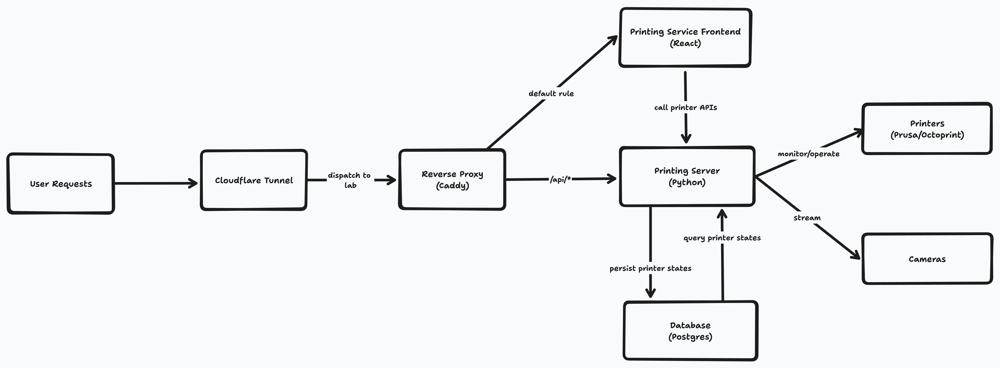
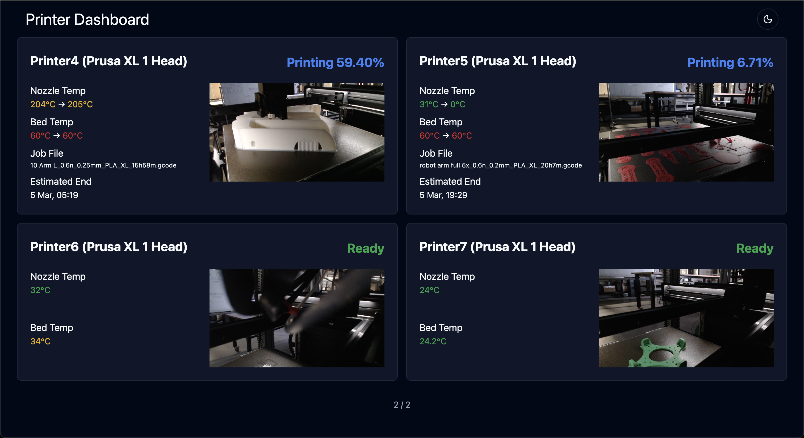

# Manufacturing Execution System

Printing service is available [here](https://printing.monashautomation.com/)

## Architecture



- public access: [Cloudflare tunnel](https://developers.cloudflare.com/cloudflare-one/connections/connect-networks/)
- reverse proxy: [Caddy](https://caddyserver.com/docs/getting-started)
- frontend: [printing service](https://github.com/monash-automation/mes-printing-service)
- backend: [printing server](https://github.com/monash-automation/mes-printing-server)

## Run

```shell
sudo docker compose up -d
```

Or run services according to dependencies:

```shell
sudo docker compose up -d db # Database for printer server
sudo docker compose up -d opcua-server
sudo docker compose up -d printing-server # depends on db and opcua-server
sudo docker compose up -d printing-service # Dashboard, depends on printing-server
sudo docker compose up -d redis # Bridge OPC UA and Grafana (Deprecated)
sudo docker compose up -d grafana # Old version dashboard (Deprecated)
```

## Update

Currently, MES is under development and features are still in discussion,
using Dockerhub for now is meaning less because all versions are snapshot or unstable.
Dockerhub and CI will be imported after the first version is ready.

```shell
sudo docker compose down printing-service
sudo docker image rm mes-printing-service
sudo docker compose up -d printing-service

sudo docker compose down printing-server
sudo docker image rm mes-printing-server
sudo docker compose up -d printing-server

sudo docker compose down opcua-server
sudo docker image rm mes-opcua-server
sudo docker compose up -d opcua-server
```

## Printing Service Dashboard



## Resources

[Setup a Cloudflare Tunnel](https://developers.cloudflare.com/cloudflare-one/connections/connect-networks/get-started/create-remote-tunnel/)
