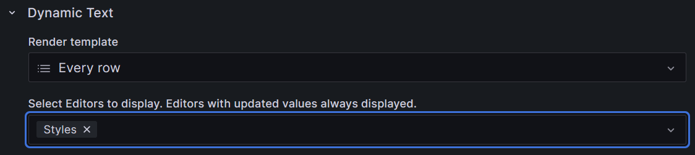

# Grafana Tamplate

## Plugin

install **Dynamic Text** in grafana and use it when add new visualization.

## .html file

copy and paste file content in **Content**

## .js file

1. select **JavaScript code before content rendering**

2. copy and paste file content in **JavaScript Before Content Rendering**

## .css file

1. select **Styles**

2. copy and paste file content in **CSS Styles**

