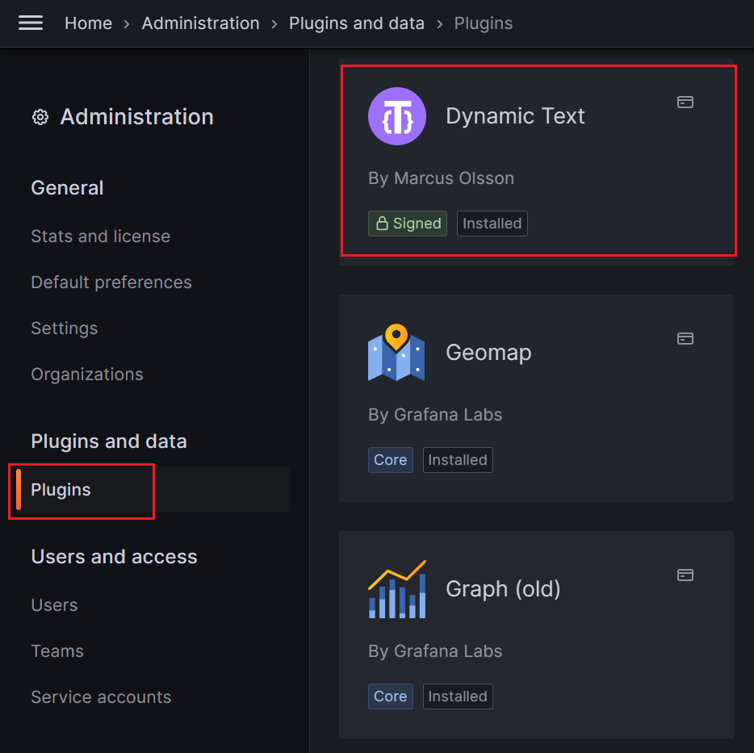
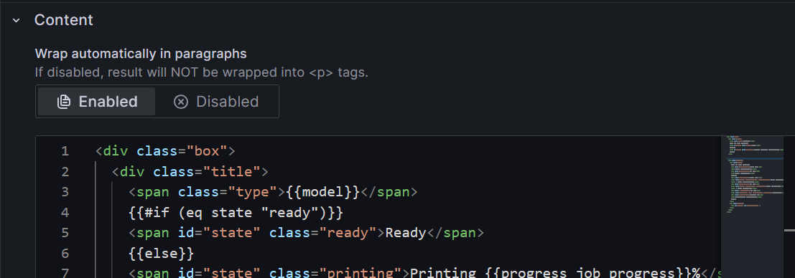
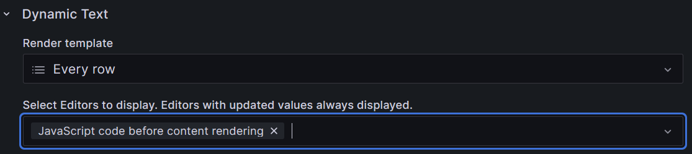
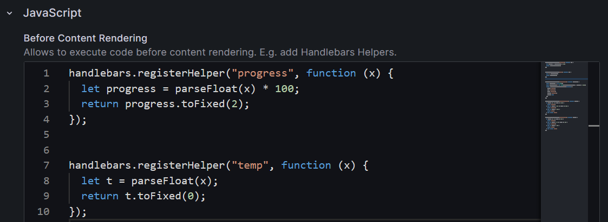
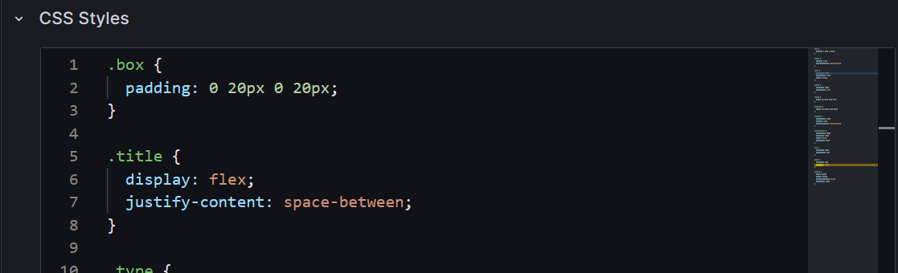

# Grafana Tamplate

## Install plugin

install `Dynamic Text` in grafana and use it when add new visualization.

## Use .html file

copy and paste file content in `Content`

## Use .js file

1. select `JavaScript code before content rendering` to show the editor

2. copy and paste file content in `JavaScript Before Content Rendering`

## Use .css file

1. select `Styles` to show the editor

2. copy and paste file content in `CSS Styles`

